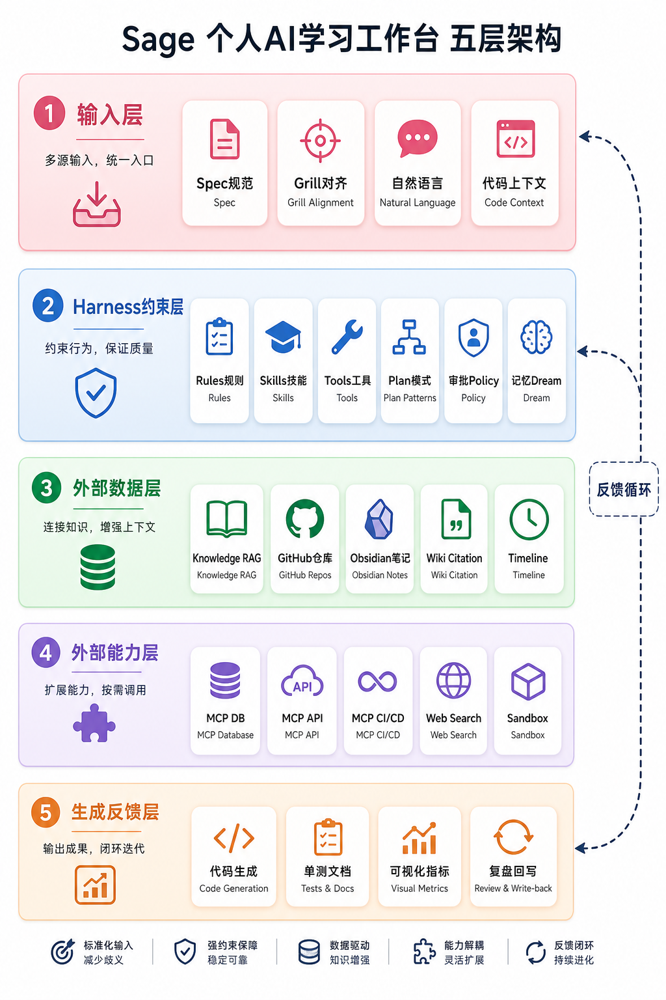
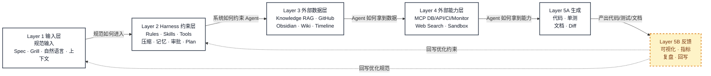

# 15 - Sage 五层目标架构

> 本章定义 Sage 下一阶段要达到的分层目标：参考 CodeBuddy / WorkBuddy 的闭环思路，结合 Sage 已有 Harness、Knowledge、MCP、Timeline 能力，形成“规范输入 → 约束执行 → 外部数据 → 外部能力 → 生成反馈”的完整系统。



**图 1：Sage 五层目标架构**

```mermaid
flowchart TB
    classDef l1 fill:#fef3c7,stroke:#d97706,stroke-width:2px,color:#78350f
    classDef l2 fill:#dbeafe,stroke:#2563eb,stroke-width:2px,color:#1e3a8a
    classDef l3 fill:#d1fae5,stroke:#059669,stroke-width:2px,color:#064e3b
    classDef l4 fill:#ede9fe,stroke:#7c3aed,stroke-width:2px,color:#4c1d95
    classDef l5 fill:#ffe4e6,stroke:#e11d48,stroke-width:2px,color:#881337

    subgraph L1["Layer 1 · 输入层（规范输入）"]
        direction LR
        L1a["Spec 规范\nrequirements / task / acceptance"]
        L1b["Grill 对齐\n需求澄清问题流"]
        L1c["自然语言指令"]
        L1d["代码 / 笔记上下文\nsurface_context / timeline"]
    end

    subgraph L2["Layer 2 · Harness 约束层（核心）"]
        direction LR
        L2a["Rules 硬红线\n.sage/rules"]
        L2b["Skills 软流程\nskill registry"]
        L2c["Tools 可执行动作\nbefore/execute/after"]
        L2d["上下文压缩\nbudget / compact"]
        L2e["记忆 / Dream\nproposal-only"]
        L2f["审批 / Policy\n五道门"]
        L2g["Plan / Agent 模式\n规划与执行分离"]
    end

    subgraph L3["Layer 3 · 外部数据层"]
        direction LR
        L3a["Knowledge RAG"]
        L3b["GitHub 仓库"]
        L3c["Obsidian 笔记"]
        L3d["Wiki / Citation"]
        L3e["Timeline 证据"]
    end

    subgraph L4["Layer 4 · 外部能力层"]
        direction LR
        L4a["MCP DB Schema"]
        L4b["MCP API"]
        L4c["MCP CI/CD"]
        L4d["MCP Monitor"]
        L4e["Web Search/Fetch"]
        L4f["Sandbox\n安全执行"]
    end

    subgraph L5["Layer 5 · 生成与反馈层"]
        direction TB
        L5A["5A 生成：代码 / 单测 / 文档 / Diff"]
        L5B["5B 反馈：可视化 · 指标 · 复盘 · 回写"]
        L5A --> L5B
    end

    L1 --> L2
    L2 --> L3
    L3 --> L4
    L4 --> L5A
    L5B -. 回写规范 .-> L1
    L5B -. 回写约束 .-> L2

    class L1,L1a,L1b,L1c,L1d l1
    class L2,L2a,L2b,L2c,L2d,L2e,L2f,L2g l2
    class L3,L3a,L3b,L3c,L3d,L3e l3
    class L4,L4a,L4b,L4c,L4d,L4e,L4f l4
    class L5,L5A,L5B l5
```



**图 2：Sage 五层反馈闭环**



## 1. 为什么要重画分层

我们之前的图多是：

```text
前端 -> API -> Runtime/Engine -> Tools/Memory/Knowledge
```

这适合解释“代码怎么跑”。  
但团队 Harness Engineering 更需要的是：

```text
规范如何进入系统
  -> 系统如何约束 Agent
  -> Agent 如何拿到数据与外部能力
  -> 如何产出代码/测试/文档
  -> 如何用结果反馈优化前面各层
```

所以目标架构改成 **5 层闭环**。

## 2. 目标五层

### Layer 1 输入层（规范输入）

输入不只是自然语言。

| 输入类型 | 说明 | Sage 现状 | 目标 |
| --- | --- | --- | --- |
| Spec 规范 | requirements / task / acceptance | 有 plan mode，Spec 产品化不足 | 复杂任务强制 Spec 门禁 |
| Grill 对齐 | 需求澄清问题流 | 有 grill-me skill，未产品化 | 进入 onboarding / plan 主流程 |
| 自然语言指令 | 用户直接提问 | ✅ | 继续保留 |
| 代码/笔记上下文 | 当前仓库、会话、引用片段 | ✅ surface_context / timeline | 与 Knowledge 更强绑定 |

**原则：**
- 复杂任务先对齐，再执行
- 聊天不是规范来源，规范要落盘

### Layer 2 Harness 约束层（核心）

这是 `Agent = Model + Harness` 的 Harness 主体。

| 组件 | 作用 | Sage 现状 | 目标 |
| --- | --- | --- | --- |
| Rules | 硬红线 | 部分存在于 AGENTS/权限策略 | `.sage/rules` 分层 + 可审计 |
| Skills | 软流程/经验 | ✅ skill registry | `allowed_tools` 强制 |
| Tools | 可执行动作 | ✅ tool registry | before/execute/after 治理总线 |
| 上下文压缩 | 长会话可续跑 | ✅ budget/compact | 与 file_ref / attachment 更强结合 |
| 记忆 / Dream | 长期事实与反思 | ✅ durable + proposal | proposal-only 保持，增强 provenance |
| 审批 / Policy | 防越权 | ✅ 五道门 | graph interrupt 主路径 |
| Plan / Agent 模式 | 规划与执行分离 | ✅ plan mode | Spec 确认后才进入执行 |

**原则：**
- prompt 管意图
- rules/skills 管规矩
- policy/approval/sandbox 管边界

### Layer 3 外部数据层

Agent 不是只靠参数里的上下文，而要接“系统的真实数据”。

| 数据源 | 作用 | Sage 现状 | 目标 |
| --- | --- | --- | --- |
| Knowledge RAG | 检索项目/笔记知识 | ✅ | 导入体验 + 引用质量提升 |
| GitHub 仓库 | 代码事实源 | 部分 | 一键导入 + 持续同步 |
| Obsidian 笔记 | 个人知识源 | 部分 | zip/路径导入产品化 |
| Wiki / Citation | 可验证回答 | ✅ 基础 | 页面/修订/失效提示完善 |
| Timeline 证据 | 运行过程可回放 | ✅ | 与学习成果/复盘打通 |

### Layer 4 外部能力层

这是“开门的钥匙”。

| 能力 | 作用 | Sage 现状 | 目标 |
| --- | --- | --- | --- |
| MCP DB Schema | 实时表结构 | 有 MCP adapter | P0 业务接入清单 |
| MCP API | 服务契约 | 有框架 | 受控 catalog |
| MCP CI/CD | 构建/流水线 | 有接口位 | Evaluator 自动触发 |
| MCP Monitor | 日志/告警 | 有接口位 | 排障子代理 |
| Web Search/Fetch | 外部资料 | ✅ 受限 | 继续证据化 |
| Sandbox | 安全执行 | 有 port | 生产 container 强制 |

**原则：**
- MCP 只接 P0/P1
- 远程内容一律 untrusted
- 生产环境危险执行必须进 sandbox

### Layer 5 生成与反馈层

#### 5A 生成层
- 代码
- 单测
- 文档更新
- Diff / 变更说明

#### 5B 反馈/监控/优化层
- 可视化结果（timeline、diff、citation、audit）
- 指标（通过率、返工率、审批拒绝率、引用命中率）
- 复盘（Dream / Evaluator / harness-audit）
- 回写（Rules / Skills / Memory proposal / Knowledge proposal）

**原则：**
- 没有反馈层，系统只会“越跑越飘”
- 反馈必须回到 Layer1 规范 与 Layer2 约束，而不是只看报表

## 3. 与 CodeBuddy 图的对应关系

| CodeBuddy | Sage 目标层 | 说明 |
| --- | --- | --- |
| Layer1 输入层 | Layer1 输入层 | 都强调 Spec + 自然语言 + 上下文 |
| Layer2 工作台/配置/模式/Agent | Layer2 Harness 约束层 | Sage 更强调 policy/approval/memory/dream |
| Layer3 MCP | Layer3 数据 + Layer4 能力 | Sage 拆开“数据事实”和“外部动作” |
| Layer4 输出 | Layer5A 生成 | 代码/测试/文档/日志 |
| Layer5 度量 | Layer5B 反馈 | 指标 + 复盘 + 回写优化 |

Sage 比 CodeBuddy 多强调两件事：
1. **Knowledge / Citation 可验证**
2. **Memory/Dream proposal-only 防幻觉污染**

## 4. 当前 Sage 到达哪一层

| 层 | 完成度 | 判断 |
| --- | --- | --- |
| L1 输入层 | 55% | 自然语言强，Spec/Grill 产品化不足 |
| L2 Harness 层 | 75% | runtime/tools/policy/timeline 强，规范 SSOT 与 after_tool 弱 |
| L3 数据层 | 70% | Knowledge/Timeline 有，导入与体验还需打磨 |
| L4 能力层 | 50% | 框架有，业务 MCP 与生产 sandbox 未闭环 |
| L5 生成反馈层 | 45% | 代码/diff/test 有，系统级反馈回写还弱 |

## 5. 下一阶段落地顺序

### Wave 1：把 L1/L2 做成“规范可执行”
1. `.sage/rules` / `.sage/skills` / `.sage/templates`
2. 复杂任务强制 Plan -> Confirm -> Execute
3. `harness-audit` 七维体检

### Wave 2：把工具调用升级成治理总线
1. before：危险拦截 / 大写保护
2. execute：timeout kill / sandbox
3. after：产物扫描 / 影响分析 / attachment 注入

### Wave 3：把 L3/L4 做成“可验证取数”
1. GitHub / Obsidian 导入引导
2. citation 质量与失效提示
3. MCP P0 清单（DB Schema / Repo / Wiki）

### Wave 4：把 L5 做成“反馈闭环”
1. Evaluator profile（test/lint/build/review）
2. Archiver profile（Knowledge/Memory proposal）
3. 指标看板：通过率、返工率、审批拒绝率、引用命中率

## 6. 一句话目标

> Sage 要成为：  
> **规范可输入、约束可执行、数据可验证、能力可扩展、结果可反馈** 的个人 AI 学习与工程协作系统。

不是只生成代码，而是持续把结果回写到规则、技能、记忆与知识资产里。
