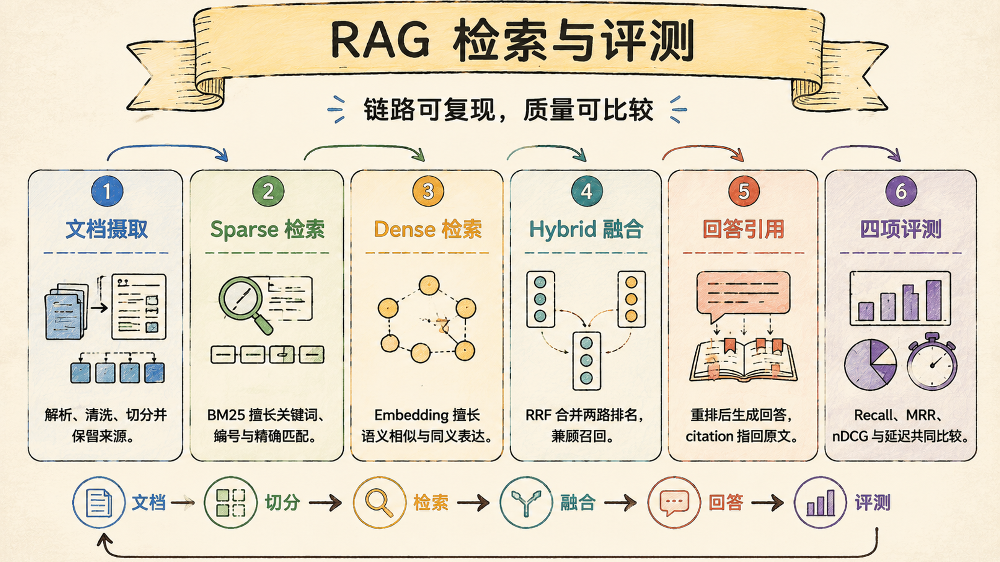
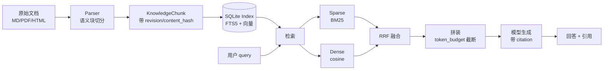

# 16 - RAG 检索全链路与多模型评测

> Last verified against: `codex/eval-resume-data` (2026-07-22)

> 本章目标：能画出 RAG 从文档到回答的全链路，解释 sparse/dense/hybrid 三路检索的差别，并读懂三模型评测数据背后的取舍。



## RAG 解决什么问题

模型的参数化知识有截止日期，也不知道你的私人材料。RAG（Retrieval-Augmented Generation）的本质是**给模型外挂一个可检索、可引用、受控写入的长期记忆**。

它回答一个问题：

> 如何让模型的回答能回到真实来源，而不是靠参数里的记忆临时编造？

这跟 Sage 的三个约束之一"回答可回到来源"直接对应。citation 指向具体 revision，不是模型编的字符串。

## 全链路：从文档到回答



### 第 0 层：ingest（灌库）

```
原始文档 → Parser → ParsedDocument（语义块）→ chunk_document → KnowledgeChunk → Index
```

- **Parser 保留语义结构**：heading/paragraph/code/list，不是暴力按字数切。chunk 带 `heading_path`，知道自己在文档哪个章节下。
- **chunk 带 `content_hash` 和 `source_revision`**：引用可追溯，不因后续编辑失效（类 Git commit）。
- **写入走 proposal + approve**：模型不能直接污染知识库。这是代码强制，不是文档约定。

### 第 1 层：retrieve（检索）

三路并行，各有取舍：

| 路 | 原理 | 优点 | 缺点 |
|---|---|---|---|
| **Sparse（FTS5 BM25）** | 词频 × 逆文档频率 | 精确关键词匹配 | 不懂语义（"lease"≠"互斥锁"） |
| **Dense（向量 cosine）** | 文本压成向量，算相似度 | 懂语义，能跨词匹配 | 可能找语义近但不对的 |
| **Hybrid（RRF 融合）** | 只看两路的排名，不看看原始分数 | 取两者之长 | 依赖 dense 有语义能力 |

**RRF 为什么不看原始分数**：BM25 和 cosine 量纲不同，直接加权无意义。RRF 只用排名：`score = 1/(60+sparse_rank) + 1/(60+dense_rank)`。两路都靠前的 chunk 融合分高。

### 第 2 层：assemble（拼装）

检索回来一堆 chunk，不能全塞进 context。`assemble_retrieval_bundle` 按 `rrf_score` 排序，累加 `token_count`，超过 `token_budget`（默认 3000）就截断。

**关键设计**：检索结果不进 context 全文，而是带 `citation_id`。模型回答时引用 citation，citation 指向具体 chunk 的 `source_revision`。这跟 artifact_ref（大输出 offload 成引用）是同一个思想--用引用替代全文，省 context + 可追溯。

### 第 3 层：generate（生成）

模型被约束成只能基于检索到的 evidence 回答，不能编造。evidence 里没有就说"知识库里没有"。这就是"可引用"约束--回答能回到来源。

## 评测：四个指标

基于 50 条 Golden Queries（每条有标准答案 `relevant_sources`），算四个指标：

| 指标 | 含义 | 通俗 |
|---|---|---|
| **Recall@K** | 前 K 个结果里正确答案被召回的比例 | 找没找全 |
| **MRR** | 第一个正确答案的排名倒数（第1名=1.0） | 找得准不准 |
| **NDCG@K** | 考虑排名位置的加权（靠前贡献大） | 最全面 |
| **HitRate@K** | 前 K 个里有没有正确答案（二值） | 有没有命中 |

## 三模型评测结果

语料：`release/v7-beta/learning` 16 个文件，768 chunks。Golden Queries 50 条（实际评估 35 条，可映射到 V7 章节）。sparse（FTS5 BM25）与 embedding 无关，三种 embedding 共用同一组 sparse 结果。

### HashingEmbedding（256d，离线词法）

| 检索方式 | Recall@5 | MRR@5 | NDCG@5 | HitRate@5 |
|---|---|---|---|---|
| sparse | 0.6571 | 0.4900 | 0.5243 | 0.6571 |
| dense | 0.5857 | 0.4414 | 0.4678 | 0.6000 |
| hybrid | 0.6143 | 0.4067 | 0.4474 | 0.6286 |

| 检索方式 | Recall@10 | MRR@10 | NDCG@10 | HitRate@10 |
|---|---|---|---|---|
| sparse | 0.8286 | 0.5150 | 0.5819 | 0.8286 |
| dense | 0.8143 | 0.4732 | 0.5429 | 0.8286 |
| hybrid | 0.8429 | 0.4408 | 0.5250 | 0.8571 |

**解读**：哈希 embedding 无语义能力，dense ≈ sparse（都是词法），RRF 融合反而稀释了 sparse 的精度。证明真实语义 embedding 不可替代。

### DashScope text-embedding-v3（1024d，真实语义）

| 检索方式 | Recall@5 | MRR@5 | NDCG@5 | HitRate@5 |
|---|---|---|---|---|
| sparse | 0.6571 | 0.4900 | 0.5243 | 0.6571 |
| dense | 0.7857 | 0.6210 | 0.6503 | 0.8000 |
| hybrid | 0.8571 | 0.6262 | 0.6783 | 0.8571 |

| 检索方式 | Recall@10 | MRR@10 | NDCG@10 | HitRate@10 |
|---|---|---|---|---|
| sparse | 0.8286 | 0.5150 | 0.5819 | 0.8286 |
| dense | 0.9714 | 0.6459 | 0.7134 | 0.9714 |
| hybrid | 1.0000 | 0.6424 | **0.7216** | **1.0000** |

**解读**：语义 dense 强，hybrid 取两者之长，最优。Hybrid + RRF 将 NDCG@10 从 sparse baseline 的 0.5819 提升至 **0.7216**（+24%），HitRate@10 达到 **1.0000**。

### Doubao embedding-vision（2048d，多模态语义）

| 检索方式 | Recall@5 | MRR@5 | NDCG@5 | HitRate@5 |
|---|---|---|---|---|
| sparse | 0.6571 | 0.4900 | 0.5243 | 0.6571 |
| dense | 0.8000 | 0.6057 | 0.6509 | 0.8000 |
| hybrid | 0.8000 | 0.5995 | 0.6467 | 0.8000 |

| 检索方式 | Recall@10 | MRR@10 | NDCG@10 | HitRate@10 |
|---|---|---|---|---|
| sparse | 0.8286 | 0.5150 | 0.5819 | 0.8286 |
| dense | 0.9429 | 0.6237 | 0.6959 | 0.9429 |
| hybrid | 0.9143 | 0.6167 | 0.6855 | 0.9143 |

**解读**：dense 很强（NDCG@10=0.6959），但 hybrid 被 sparse 拖累（dense 已够好，RRF 反而引入噪声）。亮点是**支持图片 embedding**（多模态），纯文本检索略逊 DashScope。

## 结论

1. **Hybrid 的价值依赖 dense 的语义能力**。Hashing（无语义）时 hybrid 反而更差；真实语义 embedding 时 hybrid 才优于单路。
2. **DashScope + Hybrid 最优**，适合作为文本知识库的默认方案。
3. **Doubao 多模态**适合需要图片检索的场景，纯文本略逊但维度更高、能力更广。

## 与 Harness 设计的共鸣

RAG 全链路的每个环节，都对应到 Sage Harness 的设计哲学：

| RAG 环节 | Harness 对应 | 共同思想 |
|---|---|---|
| ingest 走 proposal | Knowledge 写入 proposal-only | 长期事实不能被模型直接污染 |
| chunk 带 revision | transcript append-only | 引用可追溯，不因编辑失效 |
| citation_id 引用 | artifact_ref 引用 | 用引用替代全文，省 context + 可追溯 |
| token_budget 截断 | context budget 6 级 | 大对象不爆 context |

一句话：RAG 是"给模型外挂一个可检索、可引用、受控写入的长期记忆"。它的 revision/citation/proposal/budget 跟 Harness 的事实边界是同一套思想，只是作用在"知识"维度。

## 评测复现

```bash
# 三模型对比（需 DashScope key + 方舟 key，离线 Hashing 无需 key）
python scripts/eval_rag_resume.py --embedding all

# 单独跑某个 embedding
python scripts/eval_rag_resume.py --embedding hashing
python scripts/eval_rag_resume.py --embedding dashscope
python scripts/eval_rag_resume.py --embedding doubao
```

脚本：`scripts/eval_rag_resume.py`、`scripts/dashscope_embedding.py`、`scripts/doubao_embedding.py`。embedding 有本地缓存，重跑不重复调 API。

## 当前边界

- 语料规模小（16 文件 / 768 chunks），后续计划扩展 GitHub 公开技术文档。
- Golden Queries 是 V6 知识结构，映射到 V7 有损（50 条中 35 条可映射）。
- 多模态检索（图片 embedding）未纳入评测，仅验证了 doubao-embedding-vision 文本输入可用。
